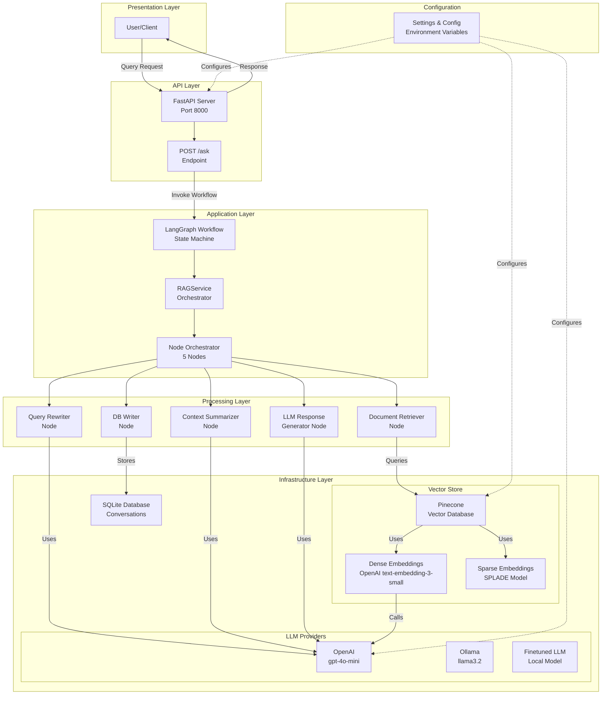
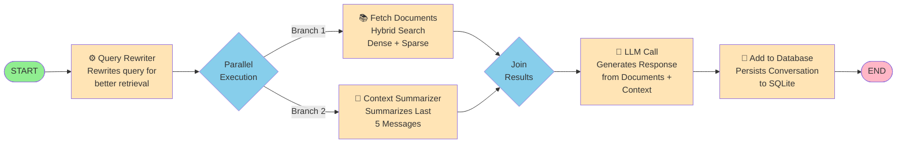
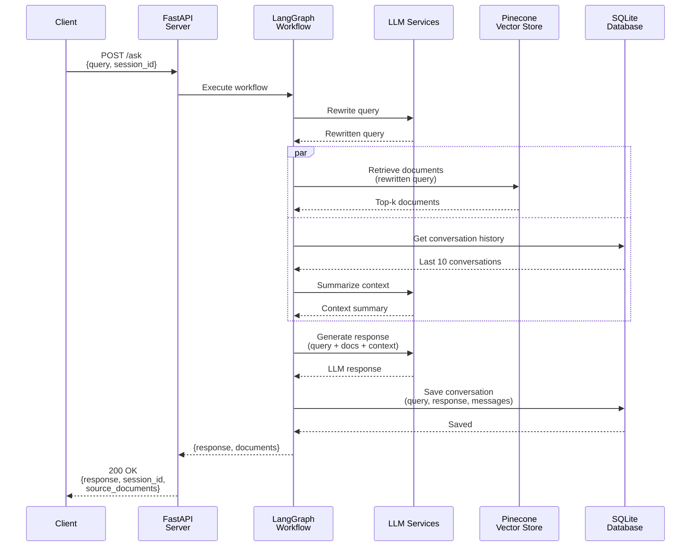
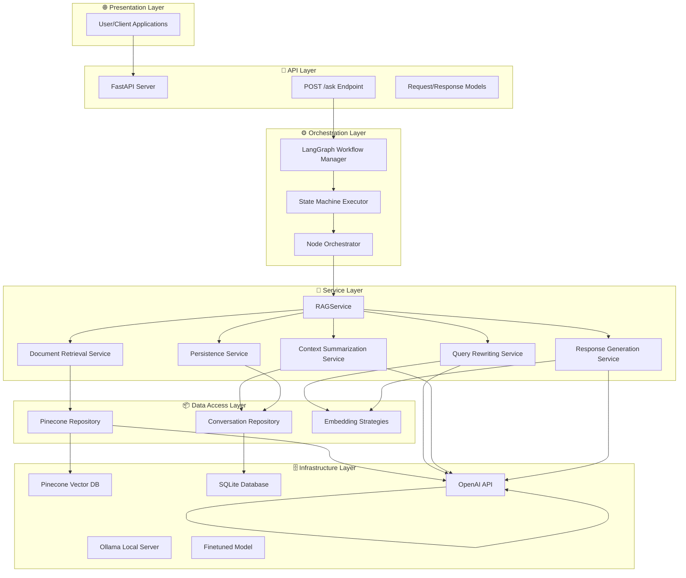
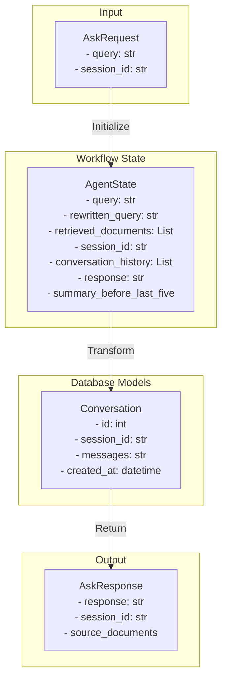
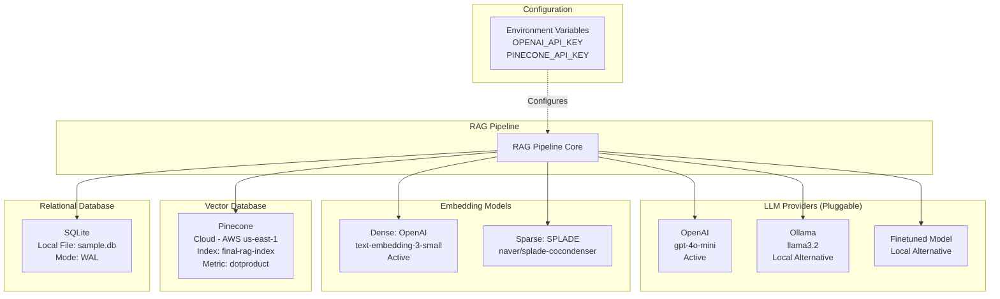
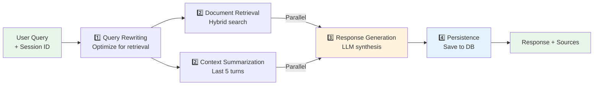
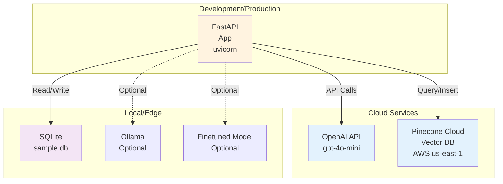

# RAG Pipeline System Architecture

## 1. High-Level System Architecture



## 2. LangGraph Workflow State Machine



## 3. Request/Response Data Flow



## 4. Component Architecture Layers



## 5. Data Models & State Management



## 6. External Dependencies & Integrations



## 7. Processing Pipeline Flow



## 8. Key Features & Patterns

### Parallel Processing
- **Fan-out/Fan-in Pattern**: Query rewriter outputs are distributed to document retrieval and context summarization simultaneously
- **Async Execution**: All API calls are non-blocking using `asyncio.to_thread()`

### Pluggable Components
- **LLM Abstraction**: Easy switching between OpenAI, Ollama, or Finetuned models
- **Embedding Strategy**: Support for both dense (OpenAI) and sparse (SPLADE) embeddings
- **Vector DB Protocol**: Abstract interface for vector database operations

### Data Persistence
- **SQLite with WAL**: Write-Ahead Logging for concurrent reads
- **Session-based Conversations**: All interactions stored with session tracking
- **Indexed Queries**: Fast lookup by session_id

### Domain-Specific
- **Financial Compliance Domain**: Prompts and instructions tailored for compliance queries
- **Context-Aware Responses**: Uses conversation history for coherent multi-turn interactions

## 9. Technology Stack Summary

| Layer | Technology | Version |
|-------|-----------|---------|
| **Web Framework** | FastAPI | 0.135.2+ |
| **Workflow Engine** | LangGraph | 1.1.3+ |
| **LLM Orchestration** | LangChain | 1.2.13+ |
| **Vector Database** | Pinecone | 8.1.0+ |
| **Embeddings** | Sentence Transformers | 5.3.0+ |
| **LLM APIs** | OpenAI | Latest |
| **Database** | SQLAlchemy + SQLite | Latest |
| **ASGI Server** | Uvicorn | 0.42.0+ |
| **Evaluation** | Ragas | 0.4.3+ |

## 10. Deployment Architecture



## Configuration & Environment Variables

```bash
# LLM Configuration
OPENAI_API_KEY=sk_...          # Required for OpenAI
OPENAI_MODEL=gpt-4o-mini       # Active model

# Vector Database
PINECONE_API_KEY=...            # Required
PINECONE_INDEX=final-rag-index-openai-small
PINECONE_METRIC=dotproduct

# Database
DATABASE_URL=sqlite:///sample.db

# Embedding Models
DENSE_EMBEDDING=openai          # or sentence-transformers
SPARSE_EMBEDDING=splade         # SPLADE for sparse embeddings

# API Server
API_HOST=0.0.0.0
API_PORT=8000
```

## How to Read These Diagrams

1. **High-Level Architecture**: Start here to understand all components and how they connect
2. **Workflow State Machine**: See how data flows through the 5 processing nodes
3. **Data Flow Sequence**: Understand the step-by-step request/response cycle
4. **Layer Architecture**: Understand the separation of concerns and abstraction levels
5. **Dependencies**: See what external services are required and what's pluggable
